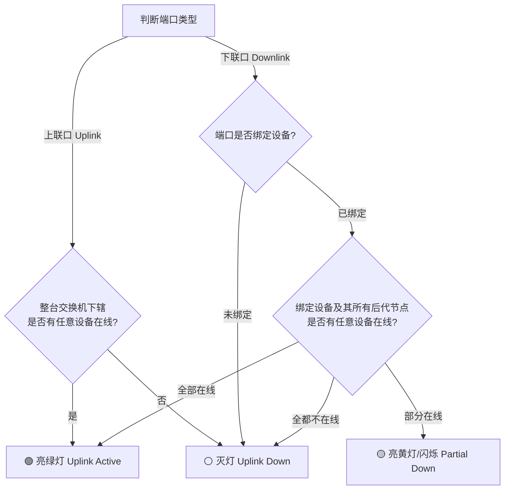

# 非网管交换机“模拟端口亮灯”设计方案

## 一、 背景与核心痛点

在网络拓扑与状态监控场景中，普通的**非网管交换机（Unmanaged Switch / 傻瓜交换机）**具备以下特点：
- **无 IP 地址**，不支持 ICMP Ping 探测。
- **无网管功能**，不支持通过 SNMP 或 Web API 直接读取接口（Port）的物理 Link 状态。

**解决方案**：
利用 WebWeaver 现有的网络拓扑父子关系（`parent_id`），在交换机属性中扩展端口绑定配置，通过**下级链路连通性反向推算端口状态**，并在前端渲染拟真交换机模型及其 LED 端口指示灯。

---

## 二、 核心机制与数据配置

### 1. 交换机设备扩展属性

在交换机（`type == 'switch'` 或扩展类型 `'unmanaged_switch'`）的属性中设置以下参数：

- **端口总数 (`port_count`)**：如 5 / 8 / 16 / 24 / 48 口。
- **上联端口 (`uplink_port`)**：指定接入上级网络/主交换机的端口号（如 Port 1 或 Port 24）。
- **端口绑定关系 (`port_bindings`)**：指定每个端口连接的设备 ID（支持直连子设备）。

### 2. 状态推算算法 (Led Status Logic)



| 端口类型 | 条件 | 指示灯状态 | 说明 |
| :--- | :--- | :--- | :--- |
| **下联口 (Downlink)** | 绑定设备自身在线，或其**向下任意一级子设备**存在在线节点 | 🟢 **常亮绿灯 (Active)** | 端口物理与逻辑链路畅通 |
| **下联口 (Downlink)** | 端口未绑定，或绑定设备及其所有后代节点**全都不在线** | ⚪/⚫ **灭灯 (Inactive)** | 端口空置或下辖线路/设备断开 |
| **下联口 (Downlink)** | 下辖设备大于 1 台，且存在部分在线、部分离线 *(扩展)* | 🟡 **亮黄灯 / 闪烁 (Partial)** | 端口连通但下辖存在局部故障 |
| **上联口 (Uplink)** | 该交换机下辖的设备中，**存在任意一台在线** | 🟢 **常亮绿灯 (Uplink Active)** | 交换机上联主干网络正常 |

---

## 三、 UI 拟真模型与交互设计

1. **交换机面板模型 (Switch Visual Model)**
   - 依照真实交换机布局渲染端口（如双排网口：上排 1-12，下排 13-24）。
   - 每个 RJ45 网口上方/旁边展示动态 LED 效果（支持 SVG / CSS 光晕动画）。

2. **悬停与点击交互 (Hover & Tooltip)**
   - 悬停在端口上时显示详细信息浮窗：
     - **端口号**：Port 3 [下联]
     - **直连设备**：3F-会议室交换机 (ID: 105)
     - **链路状态**：正常 (Link Up)
     - **下辖健康度**：5/6 台设备在线

---

## 四、 数据结构参考 (Data Schema)

### 设备模型字段扩展 (`Device`)

```json
{
  "id": 10,
  "name": "1F-接入交换机(傻瓜式)",
  "type": "unmanaged_switch",
  "status": "unknown", 
  "port_count": 8,
  "uplink_port": 1,
  "port_bindings": {
    "1": { "target_id": 1, "type": "uplink" },
    "2": { "target_id": 101, "type": "downlink" },
    "3": { "target_id": 102, "type": "downlink" },
    "5": { "target_id": 105, "type": "downlink" }
  }
}
```

---

## 五、 方案优势与价值

1. **零硬件成本**：无需购买昂贵的网管交换机即可实现端口可视化。
2. **极简排障**：通过灯光直观反映端口下辖线路状态，迅速定位拔线、断电或设备故障。
3. **架构天然契合**：结合 WebWeaver 现有的树状拓扑图，计算逻辑轻量且高效。
